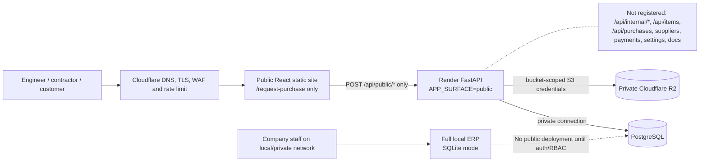

# Incoming Purchase Requests — production deployment runbook

Status: prepared, not deployed. The internal ERP must remain local/private until
real user authentication, authorization, and audit controls are implemented.

## 1. Approved production shape

Use these services:

| Service | Recommended product | Public? | Purpose |
|---|---|---:|---|
| Public web | Render Static Site | Yes | React bundle containing only `/request-purchase` |
| Public API | Render Starter Web Service | Yes | FastAPI process with `APP_SURFACE=public` |
| Database | Render Postgres Basic-256mb | No | Managed PostgreSQL; inbound network access disabled after migration |
| Attachments | Cloudflare R2 Standard, private bucket | No | S3-compatible object storage for uploads and logical backups |
| Edge/DNS | Cloudflare DNS + proxy/WAF | Yes | TLS edge, path/rate rules, DNS |
| Backups | Render paid Postgres PITR + Render Cron logical dump to R2 | No | Recovery and independently retained export |

Neon Launch can replace Render Postgres without code changes. Use its pooled,
TLS-required connection string for `DATABASE_URL`.

### Estimated monthly cost (27 July 2026)

- Recommended Render baseline: about **US$14/month**: approximately US$13 for one always-on Starter
  API and Basic-256mb Postgres on the free Hobby workspace, plus PostgreSQL
  storage at **US$0.30/GB-month**, plus the Render Cron Job's US$1/month minimum
  and usage above included bandwidth/build limits.
- Render Static Site and managed TLS: **US$0/month** within included limits.
- Cloudflare R2 Standard: normally **US$0/month at this scale** while below its
  10 GB-month, 1 million Class A, and 10 million Class B monthly free allowance;
  above that, storage is US$0.015/GB-month, writes US$4.50/million, reads
  US$0.36/million, and direct R2 egress is free.
- Domain registration is separate (typically US$10–25/year depending on TLD).
- Alternative Neon Launch advertises a typical **US$15/month** workload estimate;
  its Free tier is suitable for staging, not the recommended operational target.

Recheck provider pricing before purchase:

- https://render.com/articles/how-much-does-cloud-application-hosting-cost-for-small-businesses
- https://developers.cloudflare.com/r2/pricing/
- https://neon.com/pricing

## 2. Security boundary



Code enforcement is stronger than a reverse-proxy path rule: in production,
`APP_SURFACE=public` registers only the public router. A production process refuses
to start with `APP_SURFACE=full`. Swagger, ReDoc, and OpenAPI are disabled on the
public service. The public frontend uses a separate webpack entry and therefore
does not ship internal screens or internal API URLs.

Attachments are never public bucket objects and are not persistently stored on the
application filesystem. Future authenticated staff downloads must continue through
the protected internal API or short-lived, narrowly scoped signed URLs.

## 3. Environment variables

Use `deploy/env/public-api.env.example` and
`deploy/env/public-frontend.env.example`; the backup cron uses
`deploy/env/backup.env.example`. Values marked secret belong only in the
provider secret manager—not source control.

| Variable | Required production value |
|---|---|
| `APP_ENV` | `production` |
| `APP_SURFACE` | `public` |
| `DATABASE_URL` | Render/Neon PostgreSQL TLS connection string |
| `ATTACHMENT_STORAGE_BACKEND` | `s3` |
| `R2_ENDPOINT_URL` | `https://ACCOUNT_ID.r2.cloudflarestorage.com` |
| `R2_ACCESS_KEY_ID` | Secret, read/write token scoped to attachment bucket only |
| `R2_SECRET_ACCESS_KEY` | Secret |
| `R2_BUCKET_NAME` | Private attachment bucket |
| `R2_REGION` | `auto` |
| `CORS_ORIGINS` | Exact public form origin, e.g. `https://requests.example.com` |
| `TRUSTED_HOSTS` | Exact API hostname, e.g. `api-requests.example.com` |
| `FORCE_HTTPS` | `true` |
| `REQUEST_PRIVACY_SALT` | Secret random value, at least 32 characters |
| `PUBLIC_REQUEST_RATE_LIMIT` | `5` |
| `PUBLIC_REQUEST_RATE_WINDOW_SECONDS` | `900` |
| `PUBLIC_MAX_UPLOAD_BYTES` | `5242880` (5 MiB/file; hard code cap 10 MiB) |
| `PUBLIC_MAX_TOTAL_UPLOAD_BYTES` | `26214400` (25 MiB/request; hard cap 50 MiB) |
| `PUBLIC_MAX_HTTP_BODY_BYTES` | `28311552` |
| `PUBLIC_MAX_REQUEST_ITEMS` | `20` (hard cap 50) |
| `REACT_APP_PUBLIC_API_URL` | Exact public API origin; frontend build-time value |

Local development requires none of these. Its defaults remain full application,
SQLite, local attachments, and localhost CORS.

## 4. DNS and HTTPS

Example domain: `example.com`.

| Type | Name | Target | Proxy |
|---|---|---|---|
| CNAME | `requests` | Render static hostname shown by Render | DNS-only for initial Render verification; proxy after TLS verifies |
| CNAME | `api-requests` | Render API hostname shown by Render | DNS-only for initial Render verification; proxy after TLS verifies |

Do not create DNS records for the local ERP. Add both custom domains in Render,
verify them, then set `CORS_ORIGINS=https://requests.example.com` and
`TRUSTED_HOSTS=api-requests.example.com`. Render issues/renews certificates and
redirects HTTP to HTTPS. After the custom domains work, disable each service's
default `onrender.com` subdomain so edge rules cannot be bypassed.

If CAA records already exist, allow `letsencrypt.org` and `pki.goog`. Do not add an
AAAA record for a Render destination. Provider guide:
https://render.com/docs/custom-domains

## 5. Edge and application controls

At Cloudflare, configure these rules on `api-requests.example.com`:

1. Allow `OPTIONS` and `POST` only for `/api/public/purchase-requests`.
2. Allow `GET` only for `/api/public/purchase-requests/health` (or monitor it from
   Render only and block it at the edge).
3. Block every other path before it reaches Render.
4. Rate-limit submission POSTs to 5 requests per 15 minutes per source IP. Challenge
   first; block repeated abuse for one hour.
5. Set a 28,311,552-byte request-body ceiling where the plan supports it.
6. Enable managed WAF rules and bot/challenge controls. Keep the form honeypot,
   idempotency token, recent-content fingerprint, and application rate limiter.
7. Strip untrusted forwarded-IP headers at the edge. Enable trusted proxy handling
   only after verifying the provider's forwarded-IP behavior.

The API also verifies the file signature—not only the filename or browser MIME—for
PDF, PNG, JPEG, and WebP, enforces individual/aggregate size limits, sanitizes the
filename, stores a SHA-256 digest, and returns `Cache-Control: no-store`.

## 6. Database migration plan

The scripts never delete or reset the source SQLite database. PostgreSQL execution
requires an empty, already migrated target and uses one transaction.

### Preflight (no writes)

From `backend` with production dependencies installed:

```powershell
.\.venv\Scripts\python.exe .\scripts\migrate_sqlite_to_postgres.py `
  --sqlite .\procurement.db
```

Save the dry-run JSON. It includes SQLite integrity status, SHA-256, per-table
counts, and financial totals for purchases, purchase lines, payments, and price
history.

### Prepare target

1. Create paid Render Postgres (or Neon Launch) in the same region as the API.
2. After the required CI release gate passes, apply the additive baseline through
   the verified production migration runner documented in
   `docs/deployment-readiness.md`. Even an empty target receives a validated
   pre-migration dump before Alembic runs. Direct production `alembic upgrade`
   commands are prohibited.

3. Create a private R2 Standard bucket. Disable public access and `r2.dev`.
4. Create an R2 API token scoped only to that bucket with Object Read & Write.
   The S3 endpoint and token procedure are documented at
   https://developers.cloudflare.com/r2/api/tokens/.
5. If local incoming attachments exist, validate first, then upload once:

```powershell
.\.venv\Scripts\python.exe .\scripts\migrate_attachments_to_r2.py `
  --sqlite .\procurement.db `
  --upload-root .\storage\incoming_requests

.\.venv\Scripts\python.exe .\scripts\migrate_attachments_to_r2.py `
  --sqlite .\procurement.db `
  --upload-root .\storage\incoming_requests `
  --execute
```

### Maintenance-window copy

1. Stop public/local writes briefly; do not stop until the dry run is clean.
2. Set `TARGET_DATABASE_URL` to the empty PostgreSQL target.
3. Execute:

```powershell
.\.venv\Scripts\python.exe .\scripts\migrate_sqlite_to_postgres.py `
  --sqlite .\procurement.db `
  --backup-dir .\backups `
  --report .\backups\sqlite-to-postgres-verification.json `
  --execute
```

Before copying, the script creates a consistent SQLite backup using SQLite's backup
API and verifies `PRAGMA integrity_check`. It refuses a non-empty PostgreSQL target.
After copying, it compares every table count and all defined financial totals. Any
mismatch raises an error and rolls the entire PostgreSQL transaction back.

4. Independently compare the report and retain the source DB, backup DB, SHA-256,
   and report. Never delete the SQLite source after cutover.

## 7. Exact deployment sequence

No command in this section has been executed by this preparation phase.

1. Merge only after the required CI `release-gate` passes for the exact commit;
   it covers backend/frontend tests, both builds, Python compilation, migration
   validation, public build isolation, and SQLite integrity.
2. Create private R2 attachment and backup buckets; create separate least-privilege
   tokens for application attachments and backup writes.
3. Create Render resources from `render.yaml`. The Blueprint intentionally contains
   no internal ERP service.
4. Enter secret/environment values in Render. Do not place values in YAML or `.env`
   files committed to Git.
5. Run `verified_production_migration.py` with the tested commit SHA. It verifies a
   PostgreSQL dump locally and after an R2 round-trip before applying Alembic.
   Render's pre-deploy command only asserts that the schema is already current.
6. Perform the attachment and SQLite-to-PostgreSQL migration above. Confirm every
   count/total and both backup checksums.
7. Deploy the API and verify:
   - health returns 200;
   - `/api/purchases`, `/api/items`, `/api/internal/*`, `/docs`, and `/openapi.json`
     all return 404;
   - invalid MIME/signature, oversize files, honeypot, and rate limits reject;
   - one valid form submission produces one reference and a private R2 object.
8. Deploy the static site from the `frontend` root using the public CRACO
   entry in `render.yaml`.
9. Inspect built JavaScript and reject release if it contains `/api/internal/`,
   `/purchases`, `/suppliers`, or other internal route strings.
10. Configure and verify DNS/TLS, then disable both `onrender.com` subdomains.
11. Enable the Cloudflare path, WAF, body-size, and rate-limit rules.
12. Run an Arabic RTL browser acceptance test from a non-company network, verify the
    reference, attachment, duplicate protection, CORS rejection, and mobile layout.
13. Monitor API 4xx/5xx, database connections/storage, R2 writes, and backup results.

Render's FastAPI deployment command guidance is at
https://render.com/docs/deploy-fastapi. Blueprint schema is at
https://render.com/docs/blueprint-spec.

## 8. Backup and restore

### Automated backups

- Paid Render Postgres continuously backs up for point-in-time recovery. Hobby
  workspaces currently receive a 3-day recovery window; Pro receives 7 days.
- `render.yaml` provisions `procurex-postgres-backup`, a daily private-network
  Render Cron Job built from `deploy/backup/Dockerfile`. It runs `pg_dump`, validates
  the archive with `pg_restore --list`, writes SHA-256, and sends both files directly
  to the private R2 backup bucket. Use a separate write-only backup token where
  operationally possible.
- `.github/workflows/production-backup.yml` creates a daily custom-format `pg_dump`,
  verifies its table of contents, creates SHA-256, and uploads both to a private R2
  backup bucket. It is an optional second layer for Neon or a database endpoint
  deliberately reachable from the GitHub runner. Configure repository secrets:
  `PRODUCTION_DATABASE_URL`, `R2_BACKUP_ACCESS_KEY_ID`,
  `R2_BACKUP_SECRET_ACCESS_KEY`, `R2_ENDPOINT_URL`, and `R2_BACKUP_BUCKET`.
- Apply an R2 lifecycle policy appropriate to company retention (recommended:
  35 daily backups and 12 monthly archives). Test a restore quarterly. Lifecycle
  configuration is an operational approval because it deletes expired backups.

Render recovery/export details:
https://render.com/docs/postgresql-backups

### Safe restore drill

Never restore over the current production database.

1. Create a new empty PostgreSQL database/branch.
2. Download one `.dump` and matching `.sha256` from the private backup bucket.
3. Verify SHA-256 locally.
4. Restore into the new empty database only:

```powershell
pg_restore --no-owner --no-acl --dbname '<new-empty-database-url>' .\procurex-UTCSTAMP.dump
```

5. Run the migration script's reconciliation snapshot logic or equivalent SQL
   count/total report against both databases.
6. Point a staging public API at the restored database and run smoke tests.
7. Only after written approval, update production `DATABASE_URL` to the verified
   recovery database. Retain the former database until the observation period ends.

## 9. Rollback plan

### Before DNS cutover

Abort the deployment. The local SQLite ERP and all current data are unchanged.
Discarding an empty/failed cloud target is outside this runbook and requires explicit
approval. Fix forward, rerun Alembic on a newly approved empty target, and migrate
again from the preserved SQLite source.

### After DNS cutover but before any successful public submission

Switch the two CNAMEs back to the previous targets or put the public form in
maintenance mode. Keep PostgreSQL and R2 intact for investigation. Resume local ERP;
do not restore over it.

### After production has accepted requests

Do not roll back to SQLite blindly: that would lose new requests. First block new
submissions, export and reconcile all post-cutover request rows and R2 keys, then
choose one approved path:

- fix forward on PostgreSQL; or
- restore PostgreSQL by PITR to a new instance; or
- import the reconciled incoming-request delta into a separately backed-up local
  copy, validate, and only then switch traffic.

Every rollback requires count/total reconciliation and a retained audit report.

## 10. Production acceptance checklist

- [ ] The required CI `release-gate` passes for the exact deployment commit.
- [ ] Full backend and frontend tests pass.
- [ ] Public production build contains no internal route/API strings.
- [ ] SQLite `integrity_check` is `ok`; no foreign-key violations.
- [ ] Source and target counts/totals match exactly within documented float tolerance.
- [ ] Both SQLite backup and logical PostgreSQL backup restore successfully to new targets.
- [ ] R2 buckets are private and tokens are bucket-scoped/separate.
- [ ] CORS and trusted hosts contain exact HTTPS hostnames; no wildcard.
- [ ] Cloudflare blocks every path except the public submission and health paths.
- [ ] Render default subdomains are disabled after custom-domain verification.
- [ ] Public API returns 404 for all internal API and documentation paths.
- [ ] Authentication/RBAC project is completed before any internal ERP deployment.
